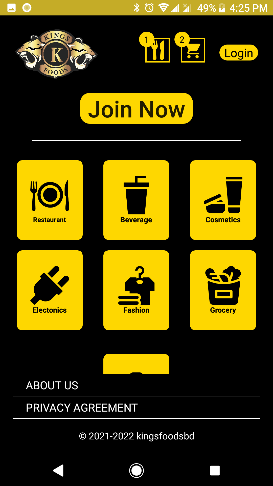

# kingsFoods
 An commercial app. (2020)

This project was developed in 2020. My first ever commercial app for kingsFoodsbd. But unfortunately they are now out of business. So to showcase my work adding this.

## Project description
Name: kingsFoods  
Programming Language: Java  
Platfrom: Android application  
Project No: update this  
Year: 2020

## Demo Video
<!--  -->

## Screen shot

### Splash Screen
 

### Guest user
#### home

#### About us

#### Privacy Terms

#### Login

#### Signup

 
 

### User
#### home

#### Sidebar

#### Profile

#### Products

#### Single Products
##### Description

##### Specification

#### Restaurants

#### Food items

#### Cart

#### Billing address

#### Order list

#### FoodOrder list

#### Order Details
  
  

 
 

## Authors

* **AbirHasan**

Check out my other works [@XAbirHasan](https://github.com/XAbirHasan)

